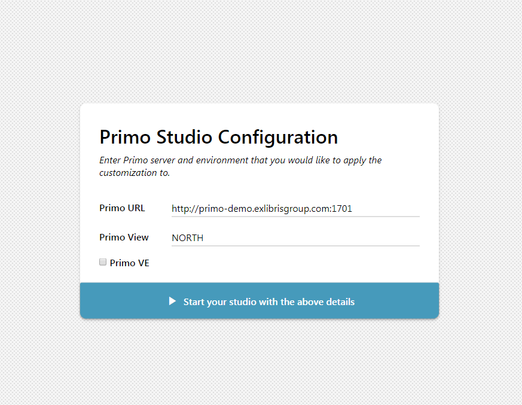
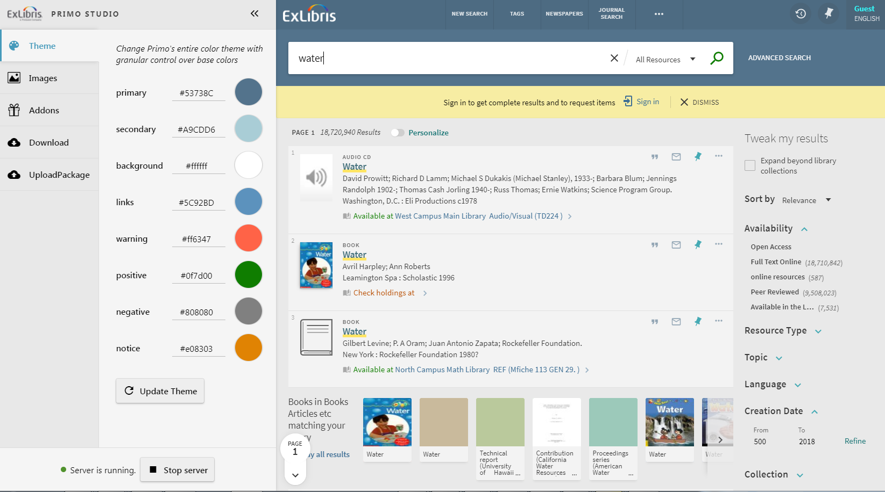
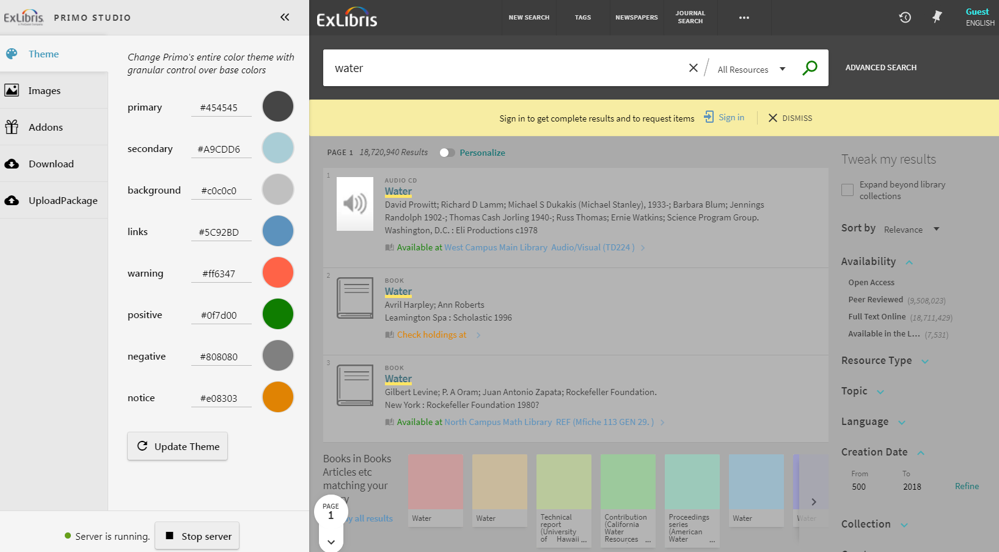
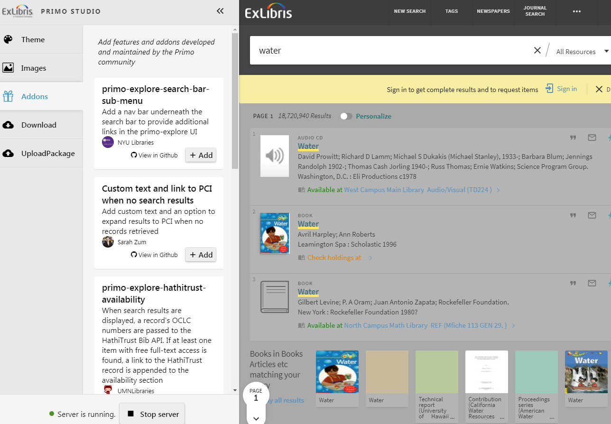

# The Primo Studio

# Description

The Primo Studio is a project that allows users to easily configure Primo New UI.

Primo Studio allows you to:

*  Configure yoor color theme.
*  Upload files: 
   *  Library Logo
   *  favicon
   *  Resource Type Icons
*  **Add features developed by the Primo Customer community**
*  Upload an existing package and work on it.
*  Download the customization you created as a zip file that can be uploaded to your Primo BO.

 
 
 
 
 
